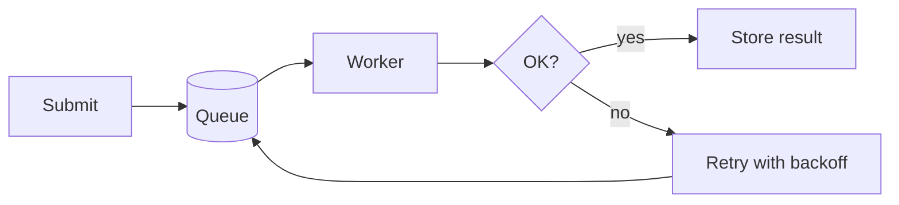

# Release notes — Orchard 2.4

A sample document for trying **mdview**. Open it with `mdview sample.md`,
flip to **Edit**, and try Find (`⌘F`), the typeface switcher, and **DOCX**.

## Highlights

- Faster cold starts — the scheduler now warms pools in the background
- New `orchard doctor` command for one-shot health checks
- Config is validated on load; typos fail fast with a line number

## Compatibility

| Area        | Change                          | Action needed        |
|-------------|---------------------------------|----------------------|
| Config      | `retry.backoff` renamed         | rename to `retry.delay` |
| API         | `/v1/jobs` adds `priority`      | none (optional)      |
| CLI         | `--verbose` now repeatable      | none                 |

## How a job flows



## Capacity math

Expected steady-state workers for arrival rate $\lambda$ and service time $\mu$:

$$ N = \left\lceil \frac{\lambda}{\mu} \cdot (1 + b) \right\rceil $$

where $b$ is the retry fraction.

## Example

```python
def backoff(attempt: int, base: float = 0.5, cap: float = 30.0) -> float:
    """Exponential backoff with a ceiling."""
    return min(cap, base * (2 ** attempt))
```

## Upgrade checklist

- ☑ Read the compatibility table
- ☐ Rename `retry.backoff` to `retry.delay`
- ☐ Run `orchard doctor`
- ☐ Deploy to staging and watch the queue depth
